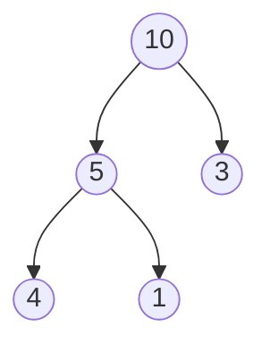

# Heapsort

**Heapsort** ordena un array usando un **montículo máximo (max-heap)**: un árbol binario donde cada padre es **mayor o igual** que sus hijos. Así, el máximo siempre está en la raíz.


---

## 1. El array es un árbol

No hace falta crear nodos: para el índice `i`
- hijo izquierdo → `2i + 1`
- hijo derecho → `2i + 2`

Array `[10, 5, 3, 4, 1]`:



---

## 2. Las dos fases

**Fase 1 – Construir el heap:** se "hunde" (*heapify*) cada nodo padre, de abajo hacia arriba, hasta que todos cumplen `padre ≥ hijos`.

`[4, 10, 3, 5, 1]` → `[10, 5, 3, 4, 1]`

**Fase 2 – Extraer el máximo:**
1. Intercambia la raíz (máximo) con el último elemento.
2. Ese máximo ya queda en su sitio final → se "saca" del heap.
3. Aplica *heapify* a la nueva raíz.
4. Repite hasta que quede un solo elemento.


---

## 3. Código (Python)

```python
def heapify(a, n, i):
    mayor = i
    izq, der = 2*i + 1, 2*i + 2
    if izq < n and a[izq] > a[mayor]: mayor = izq
    if der < n and a[der] > a[mayor]: mayor = der
    if mayor != i:
        a[i], a[mayor] = a[mayor], a[i]
        heapify(a, n, mayor)

def heapsort(a):
    n = len(a)
    for i in range(n//2 - 1, -1, -1):   # Fase 1
        heapify(a, n, i)
    for fin in range(n-1, 0, -1):       # Fase 2
        a[0], a[fin] = a[fin], a[0]
        heapify(a, fin, 0)
```

---

## 4. Resumen

| | |
|---|---|
| Tiempo (mejor / medio / peor) | **O(n log n)** |
| Memoria extra | **O(1)** (in-place) |
| ¿Estable? | ❌ No |